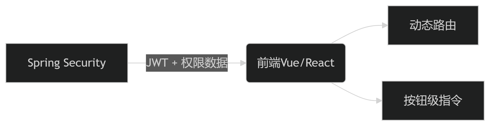
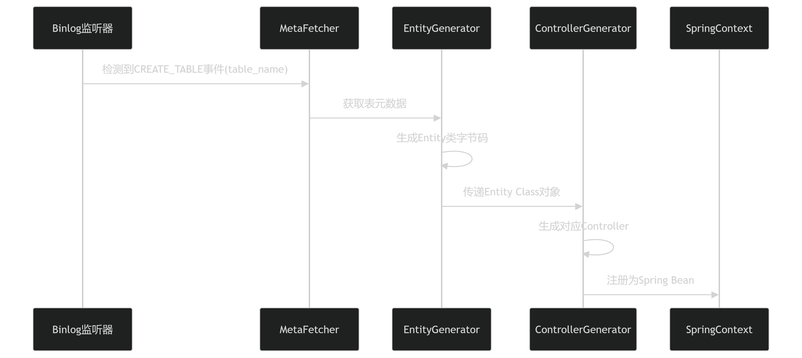
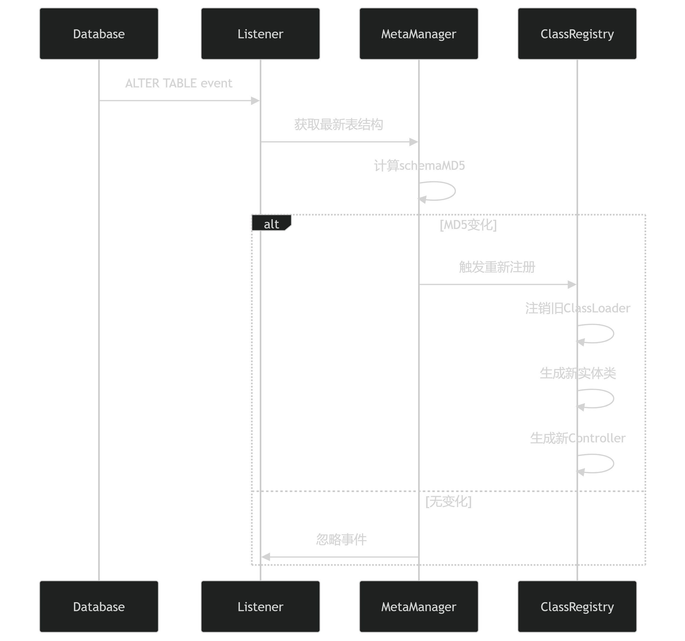

针对前端 **动态权限菜单** 和 **按钮级权限控制** 的需求，结合 Spring Security 后端权限体系，以下是完整的 **技术落地方案**，包含 **权限树动态加载、前端精细化控制、按钮权限指令** 等亮点设计，直接区别于传统 RBAC。

---

# **🌐 整体架构**
[]

---

# **🔧 后端实现（Spring Boot 3.x + JDK 17）**
## **1. 数据库设计（RBAC 增强版）**
### **核心表结构**
| 表名             | 字段说明                                |
|------------------|---------------------------------------|
| `sys_user`       | `id`, `username`, `password`, `dept_id` |
| `sys_role`       | `id`, `name`, `data_scope`（数据权限范围） |
| `sys_menu`       | `id`, `parent_id`, `name`, `path`, `component`, `perms`（如 `user:add`） |
| `sys_role_menu`  | `role_id`, `menu_id`, `btn_perms`（如 `['query', 'export']`） |

### **关键增强点**
1. **菜单表 `sys_menu`**
    - 支持 **前后端分离路由**（`component` 对应 Vue 组件路径）
    - `perms` 字段存储 **按钮权限标识**（如 `user:delete`）
2. **角色菜单关联表 `sys_role_menu`**
    - 存储 **角色可操作的按钮权限列表**（动态控制前端按钮显隐）

---

## **2. 动态权限接口实现**
### **(1) 获取用户菜单树（嵌套结构）**
```java
@RestController
@RequestMapping("/api/auth")
public class AuthController {

    @GetMapping("/menus")
    public Result<List<MenuVO>> getCurrentUserMenus() {
        // 从Spring Security上下文获取当前用户ID
        Long userId = SecurityUtils.getCurrentUserId();
        // 查询用户菜单树（递归构建父子结构）
        List<MenuVO> menuTree = menuService.buildMenuTree(userId);
        return Result.success(menuTree);
    }
}
```

**返回示例（JSON）**：
```json
[
  {
    "id": 1,
    "name": "系统管理",
    "path": "/system",
    "children": [
      {
        "id": 2,
        "name": "用户管理",
        "path": "/system/user",
        "component": "system/user/index",
        "perms": "user:query,user:add,user:export",
        "meta": { "icon": "User" }
      }
    ]
  }
]
```

### **(2) 获取用户按钮权限列表（扁平化）**
```java
@GetMapping("/buttons")
public Result<Set<String>> getCurrentUserButtons() {
    Long userId = SecurityUtils.getCurrentUserId();
    Set<String> buttons = menuService.listUserButtonPerms(userId);
    return Result.success(buttons);
}
```

**返回示例**：
```json
["user:add", "user:export", "order:delete"]
```

---

# **💻 前端实现（Vue3 + Pinia）**
## **1. 动态路由加载**
### **(1) 从接口获取菜单并转换为Vue路由**
```javascript
// src/router/dynamicRoutes.js
import { transformBackendMenuToRoute } from '@/utils/routerUtils'

export async function loadDynamicRoutes() {
  const { data: menuTree } = await getCurrentUserMenus()
  return transformBackendMenuToRoute(menuTree)
}

// 转换逻辑示例
export const transformBackendMenuToRoute = (menus) => {
  return menus.map(menu => ({
    path: menu.path,
    component: () => import(`@/views${menu.component}.vue`),
    meta: { 
      title: menu.name,
      icon: menu.meta?.icon,
      requiresAuth: true
    },
    children: menu.children ? transformBackendMenuToRoute(menu.children) : []
  }))
}
```

### **(2) 注入动态路由到Router**
```javascript
// src/main.js
const router = createRouter({...})

// 登录后加载动态路由
store.auth.login().then(async () => {
  const dynamicRoutes = await loadDynamicRoutes()
  dynamicRoutes.forEach(route => router.addRoute(route))
})
```

---

## **2. 按钮级权限控制（3种方案）**
### **方案1：全局指令 `v-permission`（最优解）**
```javascript
// src/directives/permission.js
export const vPermission = {
  mounted(el, binding) {
    const { value: requiredPerm } = binding
    const buttonPerms = store.auth.buttonPerms
  
    if (!buttonPerms.includes(requiredPerm)) {
      el.parentNode?.removeChild(el) // 直接移除DOM
    }
  }
}

// 注册指令（main.js）
app.directive('permission', vPermission)
```

**使用示例**：
```vue
<template>
  <button v-permission="'user:add'">新增用户</button>
</template>
```

### **方案2：组件包装器（适合复杂逻辑）**
```vue
<template>
  <Permission :value="'user:export'">
    <button>导出Excel</button>
  </Permission>
</template>

<script setup>
import { hasPermission } from '@/utils/auth'

const Permission = defineComponent({
  props: ['value'],
  setup(props, { slots }) {
    return () => hasPermission(props.value) ? slots.default?.() : null
  }
})
</script>
```

### **方案3：Pinia Store 判断（适合脚本）**
```javascript
// store/auth.js
export const useAuthStore = defineStore('auth', {
  state: () => ({
    buttonPerms: []
  }),
  actions: {
    async loadButtonPerms() {
      this.buttonPerms = await api.getCurrentUserButtons()
    }
  },
  getters: {
    hasPermission: (state) => (perm) => state.buttonPerms.includes(perm)
  }
})

// 组件中调用
const auth = useAuthStore()
if (auth.hasPermission('user:delete')) {
  // 执行删除操作
}
```

---

# **✨ 技术亮点设计**
## **1. 权限实时生效（WebSocket 推送更新）**
```java
// 后端权限变更时通知前端
@PostMapping("/menu/update")
public Result<?> updateMenu(@RequestBody Menu menu) {
    menuService.updateById(menu);
    // 推送权限变更消息（所有在线用户）
    wsTemplate.convertAndSend("/topic/permission-update", "菜单已更新");
    return Result.success();
}
```

**前端监听**：
```javascript
// src/utils/websocket.js
const socket = new SockJS('/ws')
const stompClient = Stomp.over(socket)

stompClient.subscribe('/topic/permission-update', () => {
  // 重新加载菜单和权限
  store.auth.loadMenus()
  store.auth.loadButtons()
})
```

## **2. 按钮权限持久化（LocalStorage + 加密）**
```javascript
// 登录成功后存储按钮权限（AES加密）
const encryptedPerms = CryptoJS.AES.encrypt(
  JSON.stringify(buttons), 
  import.meta.env.VITE_CRYPTO_KEY
).toString()
localStorage.setItem('btn_perms', encryptedPerms)

// 初始化时解密读取
function loadCachedButtons() {
  const cached = localStorage.getItem('btn_perms')
  return cached ? JSON.parse(CryptoJS.AES.decrypt(cached, key).toString(CryptoJS.enc.Utf8)) : []
}
```

## **3. 安全防护（权限双校验）**
| 层级       | 实现方式                  | 目的                     |
|------------|--------------------------|-------------------------|
| **前端**   | 按钮隐藏/禁用            | 避免用户直接看到不可操作项 |
| **后端**   | `@PreAuthorize("hasAuthority('user:delete')")` | 防止接口绕过           |

---

# **📌 部署优化建议**
1. **菜单缓存**：Redis 缓存用户菜单树，降低数据库压力
2. **权限合并**：用户首次登录时合并角色权限，避免频繁查表
3. **Tree Shaking**：前端按需加载权限相关代码（Vite 构建优化）

---

通过这套方案，你可以实现：
✅ **菜单动态加载**（支持无限层级嵌套）
✅ **按钮精确到颗粒度**（甚至控制表格列显隐）  
✅ **权限热更新**（无需用户重新登录）
✅ **前后端协同鉴权**（杜绝越权漏洞）

如果需要 **完整代码模板** 或 **具体模块的深入讲解**，可以告诉我！



